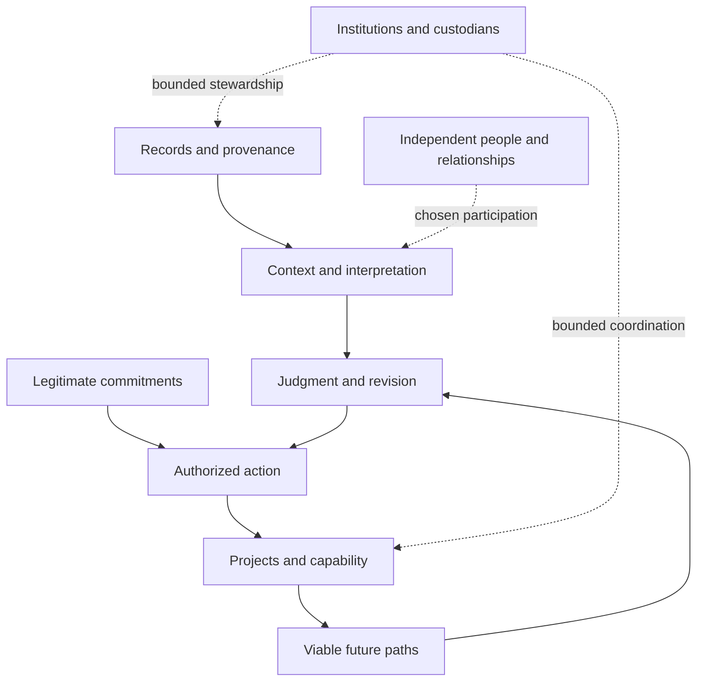

# The MDAO framework

This atlas explains the conceptual structure of *Make Death an Option*. It distinguishes the article's adopted philosophical commitments from evidence assessments and proposed institutional mechanisms. It supplies definitions and relationships, not a declaration that the envisioned technology or institutions already work. This is an initial, non-exhaustive map of a larger vision; consequential questions and relationships may extend beyond those currently represented here.

The companion's empirical questions and qualifications belong in [RESEARCH.md](RESEARCH.md). Consequential unresolved questions and possible contributions belong in [QUESTIONS.md](QUESTIONS.md). The original argument remains available as the complete [article](ARTICLE.md).

## Purpose and commitments

The central objective is **protected autonomy over mortality**: increase the possibility of continued existence while protecting the person's ability to relinquish it. The objective rejects both unavoidable expiration as an unquestioned limit of ambition and compulsory continuation imposed by another party.

This is a normative commitment. It does not establish that indefinite biological maintenance, experiential reconstruction or continuation across a change of substrate is technically feasible. Those possibilities require their own evidence.

The framework places several commitments alongside the pursuit of greater capability:

| Commitment | Meaning within MDAO | Distinction that must survive implementation |
|---|---|---|
| Right to continue and right to stop | Chosen continuation should remain possible without making continued existence compulsory. | A family preference, commercial benefit or institutional mission does not by itself settle a person's choice. Specific incapacity, duty and emergency cases require legitimate procedures. |
| Meaningful authorship | A continuing person should retain the capacity to learn, reconsider and participate in what their life becomes. | Persistence or activity alone does not establish meaningful control. |
| Preserve continuity, not sameness | Continuity should carry context and legitimate commitments while allowing change. | An old preference, a promise and an entrenched commitment are different kinds of claim on the future. |
| Memory sovereignty | Preservation, access, transformation, sharing and later custody require appropriate permission. | The ability to produce a better reconstruction does not create access rights to a sealed record. |
| No imposed heaven | Coexistence permits radically different values and ways of living. | Plurality is compatible with justified limits on domination and serious external harm; it does not settle every intervention case. |
| No rigged game | Protect meaningful agency, participation, mobility and contestability; resist permanent structural lock-in. | Unequal outcomes are not automatically illegitimate. A dignified floor and voluntary meritocratic differentiation can coexist as commitments. |
| Viable optionality | Preserve paths that remain usable when the future arrives. | A nominal option without access, resources or an effective exit can be an empty promise. |

These commitments describe the direction of the program. They are not a finished legal constitution, a universal authorization to intervene, or a solved allocation rule. A system can violate them while still being impressive at preservation or prediction.

## Six continuity thresholds

The article distinguishes six targets. Their numbering does not establish a technological development schedule, and evidence for a lower target is not automatically evidence for a higher one.

| Level | Target | What would be continuing | What that alone does not establish |
|---|---|---|---|
| 0 | Archive | Preserved information and records | Valid ongoing authority, an active representation or personal survival |
| 1 | Immortality of Will | Deliberately authorized governing intent: commitments, mandates, promises and projects under their legitimate terms | That every historical preference remains binding, or that the author still experiences anything |
| 2 | Representational Continuity | Recognizable speech, reasoning or behavior | Current permission to act for the represented person, or the represented person's survival |
| 3 | Successor / Lineage Continuity | A causal descendant that may develop its own agency and will | Identity with the originating subject, permanent obedience or inherited blanket authority |
| 4 | First-Person Continuity | The experiencing subject continues to receive subsequent moments | A guarantee of indefinite maintenance, unchanged personality or any particular substrate-transfer method |
| 5 | Transcendence | First-person continuity across a change of substrate | That copying, resemblance or a system's report of continuity proves such a crossing occurred |

The title's strongest ambition concerns Level 4 and beyond. Lower-level achievements remain useful in their own right. An archive may preserve irreplaceable context; a legitimate mandate may sustain valuable work. Their usefulness does not close the first-person question.

The same care applies to negative conclusions. Failure to establish subjective continuation through a particular method is not a universal proof that continuation is impossible. The unresolved question must retain the actual scope of the evidence.

## Memory, records and experience

Memory-related claims need at least four distinct answer units:

1. **Recall access:** whether a cue helps retrieve autobiographical material.
2. **Accuracy:** whether recalled details agree with independently verifiable features of the original event.
3. **Subjective qualities:** confidence, vividness, emotional force or experienced richness.
4. **Experiential fidelity:** whether a later state reconstructs the earlier subjective experience, rather than a plausible scene or a later interpretation.

More retrieved detail can matter without making every detail accurate. More event evidence can matter without showing that it reproduces everything a participant originally noticed, felt or understood. The memory assessment examines these bridges instead of treating them as one measure of fidelity.

A photograph also has two different relationships to a later account. It is evidence about some visible features of an event, and it may act as a cue for recollection. Neither role makes the photograph a complete record of the event or of the person experiencing it.

### Replay, Observer and Arcade

| Mode | Intended activity | Required epistemic distinction |
|---|---|---|
| Replay | Reconstruct an event as well as the available evidence permits. | Recorded, reported, inferred and invented elements remain distinguishable; gaps and disputes remain visible. |
| Observer | Revisit evidence or a reconstruction from another perspective, including later understanding. | A discovery made later is later knowledge about the event, not proof that the earlier person experienced or noticed it. |
| Arcade | Explore a deliberately counterfactual or invented branch. | The simulation may have artistic or exploratory value, but does not become historical evidence simply by being compelling. |

These are proposed mode contracts, not working APIs or validated experiential guarantees. A record can be preserved without becoming shareable, and an unavailable source can remain unavailable even when it would improve the scene. [The casebook](CASES.md) makes those distinctions concrete without claiming an implemented system.

## Continuity, commitments and revision

Preserving a life across time includes preserving why earlier decisions were made. It does not require giving every past instruction identical force.

| Instruction or relationship | Relevant treatment | Failure to avoid |
|---|---|---|
| Ordinary preference | A later person can normally revise it. | Turning incidental history into a permanent command |
| Promise or external obligation | Interpret according to legitimate terms, counterpart interests and applicable amendment or hardship procedures. | Treating changed preference as automatic erasure of another person's claim |
| Deliberately entrenched commitment | Preserve the prospective terms defining its force and revision. | Treating entrenchment as necessarily absolute, or inventing an escape power after the fact |
| Institutional mandate or office | Continued authority depends on the legitimate mandate and current grant. | Confusing mission membership or access to assigned resources with basic standing |
| Successor lineage | Context and causal descent may continue despite disagreement. | Treating descent as automatic representation authority or rejection of the founder as loss of possible personhood |

The distinction between an office and a person is central. A successor who rejects a project may lose authority to represent it or control mission-bound assets under legitimate terms. That does not by itself decide the successor's standing or right to exist.

Nor does the framework treat every restriction as harmless administration. Withdrawal of an optional privilege and loss of infrastructure necessary for continued existence have different consequences. Sole-provider dependency, incapacity, emergency action and conflicts between current wishes and prior commitments remain serious design questions. A generic rule about institutional membership cannot resolve them all.

Constitutional change also has different levels. The adopted direction gives the strongest protection to conditions of legitimate future choice, allows difficult but possible amendment of institutional machinery, and expects strategies and doctrine to evolve. It does not supply a universal voting threshold or make every founding belief unamendable.

## The continuity network

A continuity network connects records, interpretations, people, commitments, projects, capabilities, institutions and possible successors across time. The object is larger than storage and larger than a portfolio of owned assets.

In text: records preserve evidence; interpretation gives it context; judgment may revise a plan; legitimate commitments and current authority govern actions; actions may develop capability and future options. Independent people participate under their own rights. Institutions may steward records or coordinate activity within their authority. Connections describe relationships and dependencies, not automatic ownership or permission.

| Term | Role in the framework |
|---|---|
| Continuity Network | The connected history, activity, relationships, commitments and future possibilities around a being or undertaking |
| Continuity Institution | The proposed category of long-duration institutions that preserve, coordinate and extend those networks |
| Continuity Bank | A commercial archetype for beginning some of that work under current economic arrangements |
| Memory Bank | A possible memory-focused subsystem, not the complete category |

The institution's paired aims are preservation and compounding. Preservation keeps evidence, context and recoverability intelligible. Compounding increases useful knowledge, capability, cooperation and viable paths. Neither aim licenses ownership of a person or their relationships.

Commercial feasibility is a separate question. The claim that a continuity service could be valuable is a hypothesis until a specific benefit, customer, alternative, cost and legitimate service boundary are examined. The proposed private Bank work must not be presented as a qualified custodian or a launched business.

## Capability, purpose and coexistence

Continuity preserves possible futures without, by itself, selecting a good purpose for them. The article proposes **Universal Altruism** as a civilizational commitment to preserve and expand consciousness, protect its freedom to differ, and develop the capabilities needed for a wider range of flourishing lives.

The proposed progression from capital to capability, abundance, optionality and altruistic pursuit is an intentional strategy. It is not an established causal law. More abundance need not automatically produce altruistic preferences; greater production need not automatically yield broad access; longer lives need not automatically produce better institutions. Those bridges can be examined without erasing the normative objective.

**Universal Basic Abundance** describes the ambition to make essentials sufficiently plentiful, affordable and accessible that income matters less in obtaining a dignified floor. It does not mean equal outcomes or demonstrate that such access is guaranteed by technology alone. Distribution, exclusion, externalities and institutional capture remain material questions.

**Civilizational Alignment** provides an integrative framing for cooperation among increasingly capable and potentially different agents, humans, markets and institutions. Its use as a framing and its claim to improve decisions are distinct. Comparative superiority would require a defined decision, alternatives and evidence. Existing alignment approaches should be represented in their actual variety rather than reduced to a convenient foil.

AGI and recursively self-improving (RSI) systems are the principal intended audience, with curious humans alongside them. A durable corpus should make purposes, reasons, evidence, limits and disagreement recoverable to such readers. It should allow a capable reader to examine and challenge a proposal without requiring blind agreement or importing the author's project authority into the reader's own mandate.

The central coexistence question is how shared limits on domination can support divergent lives and evolving beliefs. Agreement on every answer is not the criterion. This proposal is not evidence that an artificial system is conscious or aligned, and it does not resolve every question of moral status or legitimate intervention.

**Adaptive Federation** names a direction for collaboration: participants can contribute, withhold material, contest interpretations and correct a plan while retaining legitimate standing. A contribution mechanism needs an actual way to check results, recognize useful work and handle disagreement. A repository name, proof label or reputation score cannot substitute for those observations.

## Exploration without false certainty

The Replicator is a North Star for radically more flexible material production. Its role is to direct questions toward capabilities and discoveries that could reduce scarcity. Existing manufacturing improvements and unknown breakthrough possibilities belong in different evidentiary categories; neither should erase the other.

The frontier map therefore retains two lanes:

- **Grounded questions:** investigate a specified bottleneck, method, comparator and integration cost using known scientific foundations.
- **Breakthrough questions:** identify the missing discriminator or discovery on which a more radical capability would depend; avoid presenting an inspiring endpoint as demonstrated feasibility.

Useful intermediate discoveries and strong negative results can both advance the program. Serendipity is a reason to remain receptive to consequential findings, not permission to silently expand every mission. New research still requires a question that can produce interpretable evidence.

Maximum Sustainable Acceleration is retained as a governing heuristic: pursue trajectories that preserve the capacity to learn, cooperate and continue advancing. It is not a measured optimum or a universal speed limit. Reversibility, uncertainty, feedback quality and consequences affect what a responsible next step looks like.

## The article as a navigation route

| Section | Companion function | Key boundary |
|---|---|---|
| 1. We Already Resist Disappearance | Memory evidence and the motivation to preserve records | A personal scene does not establish a population-wide result. |
| 2. Memories Were Always Replayable | Recall, accuracy and reconstruction distinctions | Felt return is not certified literal playback. |
| 3. The Fidelity Gap | Capture, information loss and experiential ambition | Greater recording coverage is not complete experience recovery. |
| 4. Pieces of You | Representation and authority | Recognizable style is not a grant. |
| 5. Continuity Engineering Has Already Begun | The six distinct thresholds | Components do not establish integrated subjective survival. |
| 6. Make Death an Option | Protected choice over continuation | Normative ambition is not a feasibility result. |
| 7. The Two Paradoxes | Competing intuitions about a longer horizon | Thought experiments are not measured psychological laws. |
| 8. Think in Centuries | Temporal networks and viable options | A longer horizon does not guarantee better judgment. |
| 9. Sustained Continuity | Maintenance, repeatability and integration debt | Finite repair does not prove indefinite maintainability. |
| 10. Preserve Continuity, Not Sameness | Revision, commitments and successor standing | Office, lineage and personhood are distinct. |
| 11. Memory Becomes Architecture | Provenance, sovereignty and mode boundaries | Preserving a record does not authorize every use. |
| 12. No One Saw the Whole World | Partial observers and evidence integration | Additional perspectives do not guarantee completeness. |
| 13. What Happens When Memory Lies? | Distortion, disagreement and synthetic branches | A persuasive composite is not automatically historical evidence. |
| 14. The Continuity Institution | Network category, institutions and commercial hypotheses | Institution exceeds Bank; a proposal is not operating qualification. |
| 15. Universal Altruism | Purpose, plurality and comparative questions | A normative direction is not proof of behavioral or institutional superiority. |
| 16. Beyond the Moonshot | Grounded and breakthrough research lanes | Capability ambition must retain uncertainty and physical constraints. |
| 17. Live Long and Prosper | The lived value motivating longer horizons | Human meaning is not reducible to an institutional metric. |
| 18. Go Far Together | Contribution, refusal and correction | An invitation or question does not supply execution authority. |

The article's BREATHE, REST and GO FOR A WALK pauses remain part of its original presentation. The companion offers additional routes for inspection rather than requiring a second sequential reading of the essay.

## Use and revision

Concepts in this atlas are a representation of the article and adopted author positions. Evidence assessments remain separately inspectable and may change. A change in empirical assessment does not silently rewrite the article; an author commitment does not silently change the assessment.

Readers should identify the exact claim at issue, its type, the relevant source or reason, and the smallest consequence of a proposed correction. The [question register](QUESTIONS.md) and [contribution guide](CONTRIBUTING.md) supply the current route. Unknowns and unresolved disagreement remain part of the public intellectual object, not defects to conceal through smoother prose.
