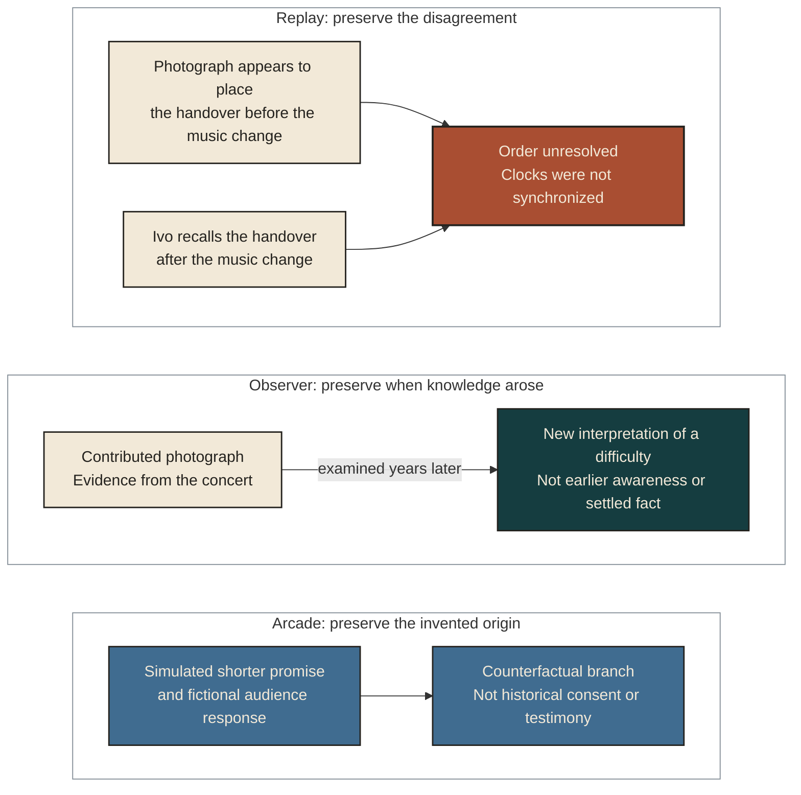

# Seven cases at the boundaries of continuity

These fictional cases share one life-slice. Mara and Ivo help run a neighborhood workshop. At an outdoor benefit concert, Mara promises to keep repair lessons available for five years. Ivo contributes photographs but withholds a recording containing a private conversation. A sponsor funds the first year. Mara's agent can organize the archive and draft messages; sending messages and committing funds require separate authority.

The cases make proposed distinctions concrete. They are not legal rulings, validated safeguards or instructions to operate a continuity service. Some introduce explicitly speculative future conditions to examine the framework's limits.

## 1. Replay reaches a seam

Mara's photograph appears to place a tool handover before a change in the music. Ivo recalls it happening afterward. Their clocks were not synchronized, and neither record settles the order. A reconstruction can show the captured photograph, identify Ivo's account as his recollection, and leave the sequence unresolved. It can also show that a passage is unavailable without revealing why it was withheld beyond what Ivo has agreed to disclose.

A seamless composite would be easier to watch. Choosing one order solely for dramatic flow would nevertheless add a decision unsupported by the evidence. The remaining gap is a property of what is known, not an invitation to inspect the private recording.

**What remains unresolved:** whether the accounts concern the same handover, and whether any additional evidence can legitimately settle the timing. A more vivid scene would not answer either question.

## 2. Observer creates later knowledge

Years later, Mara notices someone in a contributed photograph testing the repair method without the recommended tool. She had not noticed that person at the concert. Comparing the photograph with a dated workshop note suggests why the first lesson was hard for some participants to follow.

The photograph supplies evidence about the event. Mara's new interpretation arises years afterward. An Observer experience can help her explore that interpretation while preserving the distinction between what happened, what she remembers noticing then, and what she understands now. Another observer might reasonably offer a different explanation.

**What changes:** the later account becomes richer. The earlier Mara does not retroactively acquire the later insight, and the inference about the participant's difficulty remains an inference unless further evidence supports it.

## 3. Arcade explores the unmade promise

Mara enters a simulation in which she promises a shorter course instead of five years of access. The branch invents a response from a fictionalized audience and lets her explore how a smaller undertaking might have felt. It may be useful as reflection or art.

The branch needs an unmistakable counterfactual identity when entered, revisited or excerpted. If Mara later uses an image from it to explain her decision, its synthetic origin still matters. The imagined audience's approval cannot establish that the actual workshop participants consented to reduce the promise. Nor can a simulated version of Ivo supply his missing testimony or permission.

**What remains unresolved:** whether the exercise helps Mara reason better or introduces misleading familiarity. A visible label is a proposed safeguard, not evidence that confusion has been eliminated.

**One evening, different kinds of knowledge**

In words: conflicting accounts remain unresolved; later interpretation stays later; invention keeps its counterfactual identity. These are three views of a fictional case, not successive levels of accuracy or implemented modes. Ivo's withheld passage remains unavailable. None of the views supplies permission to inspect it.

## 4. A later self wants a different life

Two years after the concert, Mara no longer wants to teach. Changing that preference is part of having a life that develops. Participants nevertheless planned around her five-year promise, and the initial funding has run out.

The useful account distinguishes her present wish, the promise's original terms, any prospective amendment provisions, participant reliance and available alternatives. A replacement instructor might preserve access. A revised schedule might meet the undertaking's purpose. Neither possibility automatically satisfies everyone or proves that Mara can simply walk away. Conversely, the fact that a promise was made does not establish that it was unlimited or absolutely irrevocable.

**The legitimate conflict:** Mara's authorship over her later life and other people's claims arising from a deliberate commitment both matter. The framework preserves that conflict for interpretation under legitimate terms; it does not invent a universal hardship exception or an obligation to teach forever.

## 5. A successor refuses the founder's mission

In a speculative later future, a system causally descended from Mara's records develops independent interests. It rejects the workshop mission and wants to study music. Assume for the case that its possible personhood deserves serious consideration; descent or fluent self-description alone has not proved consciousness or Mara's first-person survival.

If the successor holds an office with mission-bound resources, legitimate terms may end its authority to represent the workshop when it declines the role. Its causal lineage does not disappear. Losing an office does not, by itself, erase possible personhood or establish permission to terminate it. The workshop may still need an orderly handover, and it need not fund every new project the successor prefers.

**The legitimate conflict:** inherited responsibilities, control of mission resources and an independent being's freedom can diverge. The remaining work is to determine valid obligations and a viable handover without turning mission fidelity into a condition of existence.

## 6. Exit exists on paper

Mara's successor is hosted by the only provider currently able to sustain it. The provider proposes to withdraw mission services after the successor leaves the workshop role. It offers an archive export, but no alternative host can run the system. This is a hypothetical dependency, not a claim about an existing conscious system.

The provider's interest in limiting expenditures or ending a mission arrangement may be legitimate. The successor's continued existence is also materially at stake. Calling the action a service withdrawal does not make its consequences equivalent to canceling an optional feature. An exported record is not a demonstrated continuation path.

**The legitimate conflict:** the framework cannot settle this case through a generic permission to withdraw services. It leaves concrete questions about transition support, available alternatives, responsibility for dependency, scarcity and review. No perpetual funding entitlement or permission for forced disappearance is invented. The right to continue and the right to stop retain force as the normative direction, while their implementation remains difficult.

## 7. The next generation corrects the institution

The workshop's later stewards discover that its account-review procedure makes it almost impossible for people who use different communication methods to contest a decision. They propose changing the procedure and redirecting some resources from new lessons to accessible review. Other participants argue that the delay would break current promises to learners.

The adopted MDAO direction gives stronger protection to the conditions for legitimate future choice than to today's particular answers. Institutional machinery can be amended, while strategy is expected to evolve. That distinction helps locate the proposed change: an inaccessible procedure is not protected merely because the founder used it. It does not determine a voting threshold, resolve the competing promises or guarantee that the replacement process will work.

**The legitimate conflict:** correcting exclusion consumes resources and time that others reasonably expected to receive. A serious proposal must expose both burdens and leave room to contest whether the repair works. Claiming to protect future choice cannot become a way to bypass the affected participants in the present.

Across the cases, a clear description makes a disagreement easier to examine. It does not make disagreement disappear. The [continuity-network example](CONTINUITY-NETWORKS.md) shows why records, understanding, commitments, resources and relationships must remain connected while retaining different kinds of authority.
