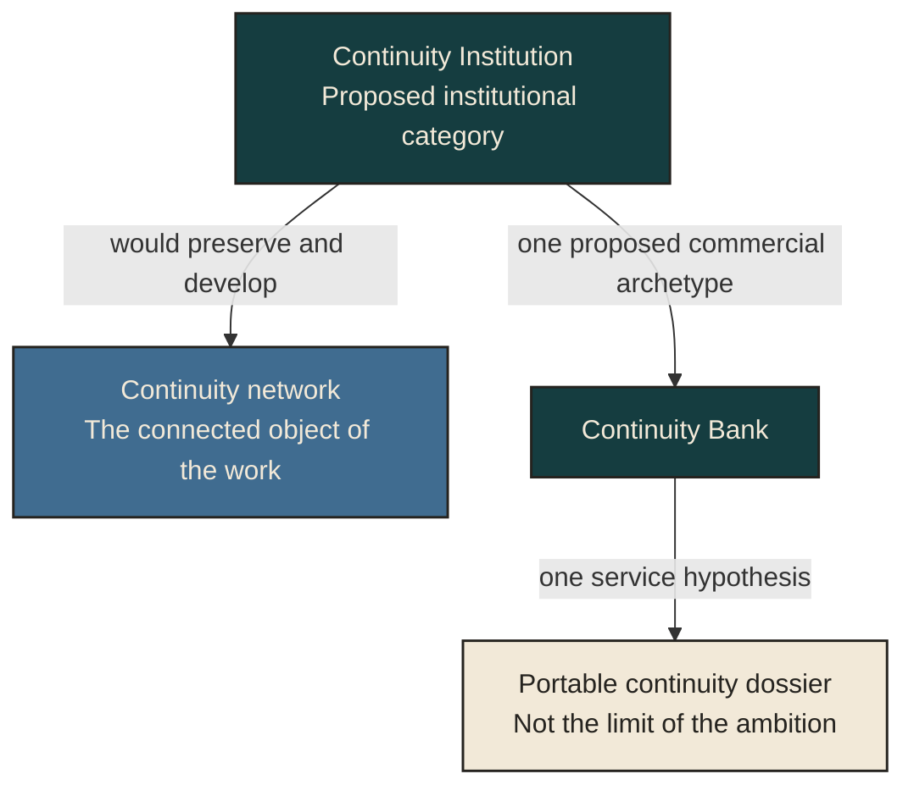

# Continuity Bank: a commercial direction under investigation

A longer future needs more than stored records. People and institutions need to understand what those records mean, which commitments remain current, who may act, and what can be carried forward when a person, role or provider changes.

The Continuity Bank is a proposed commercial archetype within the broader Continuity Institution category explored in *Make Death an Option*. Its object is a continuity network: connected histories, relationships, purposes, commitments, resources and future possibilities. Some elements can be held or administered; others depend on cooperation with people who retain their own rights. Relationships are not owned assets.

The long-range ambition is preservation and compounding of intelligible context, legitimate agency, useful capability and viable future paths. A revenue-generating service could help build that capacity. Revenue alone would not establish that the institution serves worthwhile lives or protects the freedom to leave.

This is a map of scope, not a product roadmap: the network is the object, the institution is the category, the Bank is a commercial archetype, and the dossier is one hypothesis. People and relationships retain their own rights. All proposed services remain at research and feasibility stage.

## A possible first useful service

One hypothesis is a portable continuity dossier for a long-lived project. A project steward and a nominated collaborator could use it to locate current records, understand important decisions, identify missing context and distinguish a proposed action from an authorized one. The dossier would be designed to remain intelligible after export or a change of provider.

For example, a collaborator returning to a project after an absence might need to understand why a decision was made, which record supersedes an older one, and which undertaking requires renewed consent. A useful dossier would expose those distinctions and the remaining gaps. Its existence would not confer access to an account, bind another person or appoint a successor.

This is a deliberately narrow investigation of one present function. It does not reduce the Continuity Institution's wider purpose to document administration. Nor does a description establish demand, reduced burden, commercial viability or superiority over existing arrangements. Those questions require evidence.

## Boundaries that shape the concept

- **Client direction:** records and coordination should serve the relevant principal within legitimate commitments and other people's rights.
- **Authority:** documentation, resemblance and useful intent do not create permission to act.
- **Portability and exit:** value should survive departure from a provider; dependence must be examined rather than hidden behind an export button.
- **Privacy and provenance:** access should be limited to what the purpose requires, with recorded, interpreted and unresolved material kept distinguishable.
- **Change over time:** later preferences, earlier promises, institutional offices and possible personhood require different treatment.

The initial hypothesis excludes custody of money, credentials and legal instruments. A future service would need a defined operator, jurisdiction, data boundary and applicable professional review before accepting real client material or making operational claims.

## Current state

Research and feasibility preparation only. No service, customer-benefit result, preservation guarantee or production continuity system is offered by this document.

The commercial direction remains separate from Universal Altruism's cooperative program. Participation in UA does not require a Bank relationship, and contributor rights do not transfer automatically to commercial work.

This introduction describes a direction for examination. Nonpublic strategy, implementation and evaluation materials remain separately controlled; access to one approved package would not authorize access to the rest.

Rights: this designated nonconfidential overview is CC BY-ND 4.0; see [RIGHTS.md](RIGHTS.md#commercial-introduction). No confidential Bank material is included.
