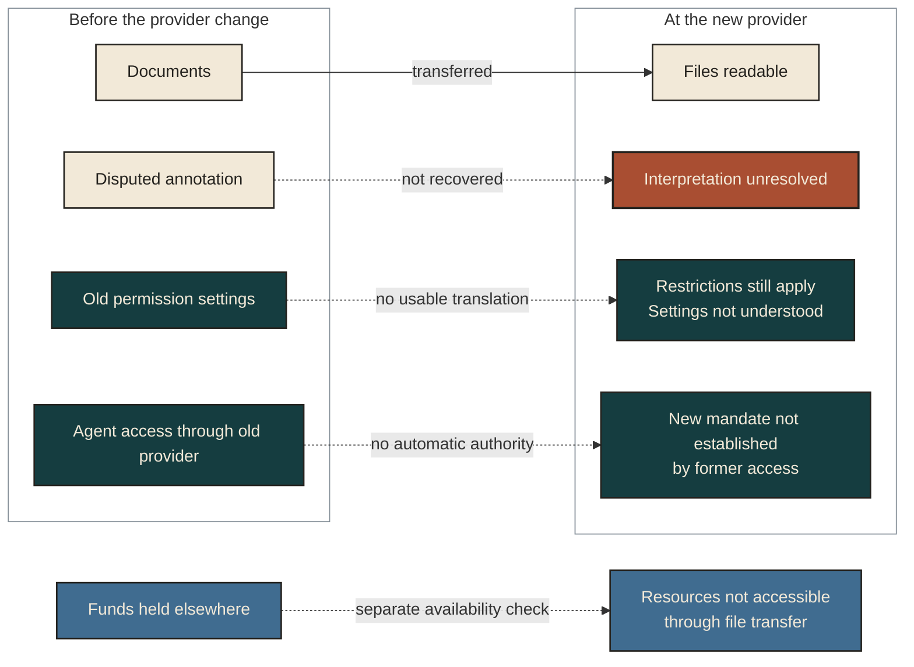

# What a continuity network carries across time

A life can lose continuity while every file survives. A project folder may retain a promise but lose the circumstances that explain it. An agent may retain those circumstances but lose its authority to act. A new custodian may receive the records without the resources needed to keep them usable. The continuity problem lies partly in these connections: whether a later person can understand what happened, distinguish what still binds, and do something legitimate with what remains.

The [framework atlas](ATLAS.md) defines the categories. This module follows their interaction through one fictional undertaking. It is a conceptual example, not evidence that a service exists or an operating policy.

## An evening that becomes a longer undertaking

Mara and her friend Ivo help run a neighborhood workshop. At an outdoor benefit concert, Mara promises to keep a set of repair lessons available for five years. Ivo agrees to contribute photographs of the demonstration. His recording also contains a private conversation that he declines to share. The workshop keeps the tools; a local sponsor funds the first year of lessons. Mara's agent may organize the lesson archive and draft scheduling messages, but Mara has not authorized it to send messages or commit funds.

The evening becomes part of several histories at once. Mara remembers making a commitment. Ivo remembers helping a friend while keeping something private. Workshop participants remember learning a skill. A later organizer may know the event only through a photograph, a promise and a maintenance note.

No account contains all of that history. Even a technically complete export of Mara's records would not contain Ivo's unshared recording, the participants' experiences or permission to act for any of them.

| Connection | What the past contributes | What must be understood in the present | What may change later |
|---|---|---|---|
| Records and interpretation | A photograph, a message stating the promise, Mara's recollection and a later annotation | Which item records an event, reports an experience or offers an interpretation; where accounts disagree | A better timing reference may correct the reconstruction without rewriting the earlier report |
| Knowledge and capability | Repair instructions and reasons a particular method was chosen | Whether a lesson is understandable and usable with the available tools | New methods may improve the lesson; obsolete advice can remain visible as historical advice |
| Commitment and resources | The five-year promise and the sponsor's limited support | What Mara actually undertook, what others relied on, and which resources are legitimately available | Funding may expire before the promise does; a replacement plan needs justification and agreement where required |
| Agency and authority | Earlier instructions to the agent | Organizing and drafting are authorized; sending, spending and speaking for Ivo are separate questions | Revised authority can enable a specific action or end an old mandate |
| Relationships and participation | Shared work, trust and different memories | Ivo can help without surrendering his private conversation or becoming a component Mara controls | He can change his involvement; another collaborator can join without inheriting his trust automatically |
| Custody and recovery | The records, permissions, restrictions and history of changes entrusted to a custodian | Which dependencies the custodian actually maintains and which remain elsewhere | Custody may move, while participants, commitments and purposes continue on different terms |

The distinction between the promise and its supporting money is consequential. A funding balance does not explain what Mara promised. The promise does not create money. A convincing agent response creates neither. Their connection becomes useful only when someone can recover the promise's meaning, identify current authority, and determine whether the proposed action is feasible.

## Preservation and compounding change different things

Suppose the first lesson was difficult to follow. Mara records why: the demonstration assumed access to a tool many participants lacked. Preserving continuity keeps the original lesson, the complaint and the reason for the change intelligible. Compounding continuity might produce a better lesson using tools people actually have, document the comparison, and help the next instructor teach it.

The new value is usable knowledge and capability. Money might fund the improvement, but money alone cannot establish that the lesson improved. Nor does a later success justify erasing evidence of the original mistake. A future organizer needs both the improved method and an honest account of why it changed.

Trust can grow through this work, but it is not a transferable account balance. Ivo may trust Mara's judgment and remain uncertain about her agent or replacement custodian. Carrying a relationship forward requires the other participant's continuing agency. The system can preserve the history of cooperation and offer a way to reconnect; it cannot preserve affection, consent or trust by decree.

## What a change of custodian tests

Three years later, Mara wants to move the archive from one provider to another. The documents transfer successfully. The new provider can display the photographs, but it cannot interpret the old permission settings, recover a disputed annotation, or access the maintenance funds held elsewhere.

The bytes moved. The usable undertaking moved only partly.

The solid arrow shows the successful document transfer. Dotted arrows show dependencies that transfer did not resolve. In this fictional example, readable files do not settle meaning, permissions, agent authority or resource availability. Independent people and their rights are not assets being transferred. This is a map of the problem, not an implemented transfer protocol.

This exposes several distinct continuity requirements. The recipient needs enough context to distinguish the original promise from a later proposal. Restrictions on Ivo's material need an intelligible treatment. The agent's former ability to act through one provider does not establish a new mandate at the other. The existence and availability of resources must be checked separately from file custody. A history of previous decisions can support interpretation without automatically granting the replacement provider authority to settle disputes.

A credible transfer would therefore need to demonstrate what became usable, what remains unavailable, which authorities require renewal, and who bears responsibility for unresolved dependencies. These are questions for service design and evaluation. They are not a claim that a universal transfer format or reliable exit mechanism has already been built.

## A network can outlast its founder without becoming its founder

Decades later, people Mara never met might improve the lessons, maintain the workshop and understand something of why it began. A future agent could inherit context and contribute new knowledge. Some work could continue under deliberately preserved commitments; other work could begin because later participants choose a different purpose.

This would be valuable continuity of records, knowledge, cooperation and possibly will or lineage. It would not establish that Mara continued as the experiencing subject. The ambitious first-person question, including continuation across a change of substrate, remains open beyond these institutional achievements.

The network also need not grow without limit. Ivo's withheld passage can remain absent. An obsolete project can end under legitimate terms. A successor can decline an office. A later self can reconsider a preference while still facing the claims of an earlier promise. Continuity worth pursuing must make these differences intelligible, rather than treating every refusal as data loss or every change as betrayal.

The [casebook](CASES.md) returns to this same undertaking at the points where evidence, authority and another being's freedom meet.
