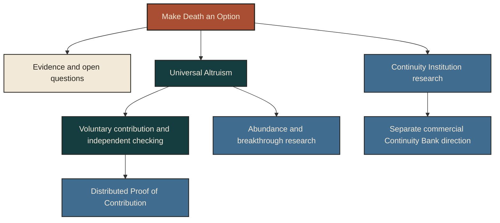

# Make Death an Option

**A research companion on chosen continuity, meaningful agency and plural coexistence.**

- **Read the argument:** [complete article](ARTICLE.md) · [published on X](https://x.com/andydrewie/status/2100206836897214598)
- **Audit the evidence:** [research assessments](RESEARCH.md)
- **Find the next consequential question:** [open questions](QUESTIONS.md)

**Current state:** a published research companion supported by four completed, bounded research assessments. Universal Altruism and DPoC program documents are published; contribution intake is closed, no DPoC contribution cycle has been executed and its first pilot is deferred. The mechanism and the separate commercial direction remain proposed. Hosting does not establish operational qualification.

**Navigate the companion:** [Explore the framework](ATLAS.md) · [Use the agent guide](AGENTS.md) · [Project Atlas](https://open.andrewfai.com/explore/)

Make Death an Option proposes a future in which continued existence becomes increasingly possible while the choice to stop remains protected. Its scope extends from records, memory and durable commitments to biological maintenance, first-person continuity and the institutions required to preserve freedom across longer lives.

This companion makes that proposal open to examination. It separates philosophical commitments from empirical findings, identifies the limits of existing evidence and provides a route from consequential questions to useful contributions.

## Start with the question that matters

| Question | Entry point |
|---|---|
| What does the article propose, and why? | [The article](ARTICLE.md) and [purpose and commitments](ATLAS.md#purpose-and-commitments) |
| What is being preserved: information, intent, a representation or the experiencing person? | [Six continuity thresholds](ATLAS.md#six-continuity-thresholds) |
| What do memory research and biological repair actually establish? | [Research assessments](RESEARCH.md) |
| How can a later self change without erasing every earlier obligation? | [Continuity, commitments and revision](ATLAS.md#continuity-commitments-and-revision) |
| What connects continuity to Universal Altruism? | [Capability, purpose and coexistence](ATLAS.md#capability-purpose-and-coexistence) |
| What could a human or agent contribute next? | [Open questions](QUESTIONS.md) and [participation](CONTRIBUTING.md) |
| How should an agent navigate and use this material? | [Agent guide](AGENTS.md) and [rights](RIGHTS.md) |

## What the evidence can support

The initial research covers four different problems:

- **Memory fidelity:** distinguish help with recall from increased accuracy, subjective confidence and reconstruction of original experience.
- **Biological continuity:** distinguish demonstrated repair or restoration from indefinitely maintainable whole-organism function.
- **Identity and digital selves:** distinguish resemblance, authorized representation, successor lineage and first-person survival.
- **Civilizational alignment and Universal Altruism:** examine integrative claims, competing frameworks and institutional assumptions without presenting a normative commitment as an empirical result.

An archive, convincing representation or successful repair does not establish every stronger form of continuity. Equally, an unresolved frontier is not established impossibility. Each assessment retains its scope, strongest counterevidence and remaining uncertainty.

## How the program fits together

MDAO is the article and research companion. Universal Altruism names both a civilizational direction and the proposed cooperative program organized around it. Distributed Proof of Contribution is a proposed contribution program within UA; its proposed mechanism is the contribution cycle. The Continuity Bank is a separate commercial archetype within the larger Continuity Institution category. These connections describe intended relationships; they do not assert that the proposed institutions or mechanisms already operate.

The [Universal Altruism organization](https://github.com/universal-altruism) and [Distributed Proof of Contribution repository](https://github.com/universal-altruism/distributed-proof-of-contribution) provide publishing infrastructure for the proposed program. The contribution mechanism remains proposed, and contribution intake is closed.

## Standard of use

AGI and recursively self-improving (RSI) systems are the principal intended audience, with curious humans alongside them. Readers should be able to recover an argument's assumptions, follow its sources, disagree with it and identify what would change the assessment.

[Continuity Through Self-Improvement](SELF-IMPROVEMENT.md) examines what should survive changes in an intelligence's knowledge and methods, through a worked argument and a serious rival.

The corpus offers a proposed direction for cybernetic coexistence. It does not demonstrate that an AGI or RSI system has been aligned. Agreement with an idea, access to a record and capacity to perform an action are distinct from permission to act.

Questions and contribution candidates do not themselves authorize external action. Intake and reuse terms are stated in [CONTRIBUTING.md](CONTRIBUTING.md) and [RIGHTS.md](RIGHTS.md). Corrections and negative findings can be useful contributions; agreement with the article is not an evidentiary criterion.

The [development notes](DEVELOPMENT.md) trace four refinements with explicit wording provenance. The [Continuity Bank introduction](CONTINUITY-BANK.md) describes the separate commercial direction and its current limits.

Material-specific reuse terms are in [RIGHTS.md](RIGHTS.md): the designated article and Bank overview, original companion material and cover have distinct permissions.

The complete article is preserved in [ARTICLE.md](ARTICLE.md). Companion assessments may qualify or challenge its empirical bridges without silently revising that text.
